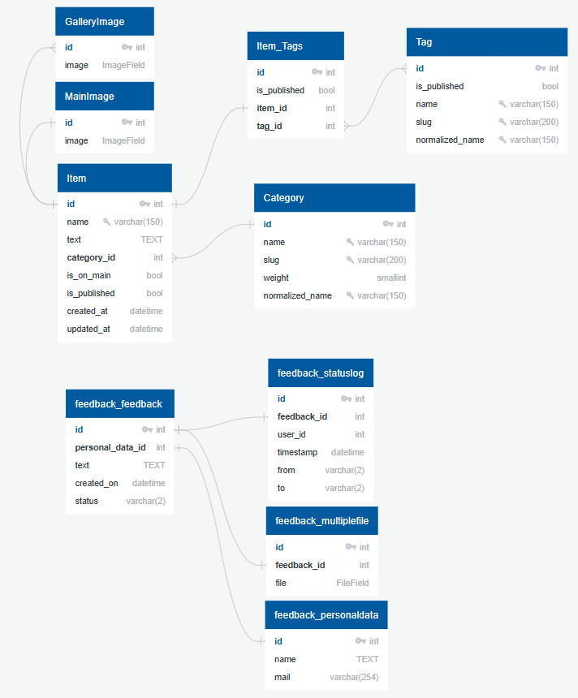

# Проект по специализации Яндекс 'Разработка веб-приложений на Django'


> Требования для нормального запуска проекта: Python версии 3.10+

## Запуск проекта в dev-режиме

- ### Клонирование репозитория на свой компьютер

```bash
git clone https://gitlab.crja72.ru/django/2024/autumn/course/students/261067-almasvildanoff-course-1187
```

- ### Создание виртуального окружения

#### Перед созданием venv перейдите в склонированную (корневую) папку проекта - `cd 261067-almasvildanoff-course-1187`

На Linux:

```bash
python3 -m venv venv
```

На Windows:

```bash
python -m venv venv
```

- ### Запуск виртуального окружения

На Windows:

```bash
venv\Scripts\activate
```

На Linux

```bash
source venv/bin/activate
```

- ### Установка зависимостей

#### Основные

На Linux:

```bash
pip3 install -r requirements/prod.txt
```

На Windows:

```bash
pip install -r requirements/prod.txt
```

#### Для тестов

На Linux:

```bash
pip3 install -r requirements/test.txt
```

На Windows:

```bash
pip install -r requirements/test.txt
```

#### Для разработки

На Linux:

```bash
pip3 install -r requirements/dev.txt
```

На Windows:

```bash
pip install -r requirements/dev.txt
```

- ### Создание файла .env для хранения переменных окружения

#### Скопируйте данные из `.env.example`(находится в корне репозитория) и запишите их в файл `.env`

На Linux:

```bash
cp .env.example .env
```

На Windows:

```bash
copy .env.example .env
```

- ### Проект поддерживает локализацию

#### Шаги для настройки локализации

1. Убедитесь, что в `settings.py`(по пути `склонированная директория/lyceum/lyceum`) включены локализация и языки; присутствует ли `gettext`:

    ```python
    LANGUAGE_CODE = "ru"
    LANGUAGES = [
        ("ru", "Russian"),
        ("en", "English"),
    ]
    ```

   - Установка gettext на Linux:

    ```bash
    sudo apt install gettext
    ```

    - На [Windows](https://mlocati.github.io/articles/gettext-iconv-windows.html)

2. Для генерации файлов перевода `(в проекте они уже сгенерированы)` используйте команду:

    ```bash
    django-admin makemessages -l ru -l en
    ```

3. После добавления переводов в файлы `.po` скомпилируйте их с помощью команды:

    ```bash
    django-admin compilemessages
    ```

- ### Переход к папке lyceum

```bash
cd lyceum
```

- ### Подготовка базы данных по данным из фикстур

На Linux:

```bash
python3 lyceum/manage.py loaddata data.json
```

На Windows:

```bash
python lyceum/manage.py loaddata data.json
```

- ### Создание супер-пользователя (если будете заходить в админку)

На Linux:

```bash
python3 manage.py createsuperuser
```

На Windows:

```bash
python manage.py createsuperuser
```

- ### Запуск проекта

#### Запущенный проект вы можете открыть в браузере по адресу `http://127.0.0.1:8000`

На Linux:

```bash
python3 manage.py runserver
```

На Windows:

```bash
python manage.py runserver
```

### Структура БД проекта


